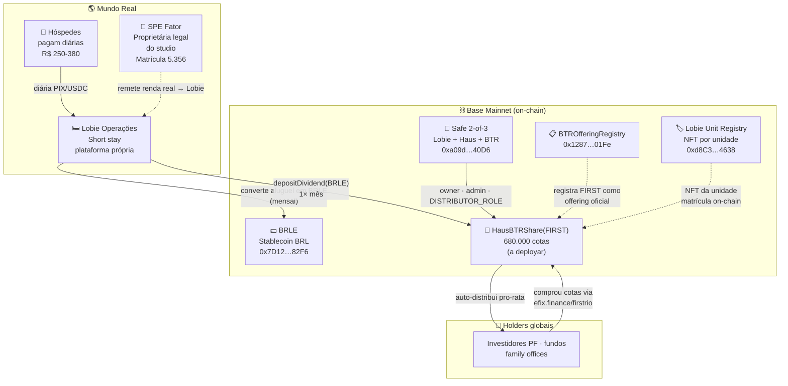

# FIRST · Pool Tokenizada — Reunião Fator Realty

**Data:** quinta · 2026-06-18 · 17h-18h BRT
**Participantes:** Tiago Miranda (Fator Realty) · Ernesto Otero (EFIX / Haus / Lobie)
**Local:** híbrido · Office presencial + Meet `meet.google.com/faq-oybo-dvj`

---

## 1. O que é FIRST

Pool de **equity fracionária tokenizada** em **1 studio do First Life Friendly** (Humaitá, RJ).
**R$ 680.000 totais · cota de R$ 1,00 · 680.000 cotas · TIR-alvo 22% a.a. em 10 anos.**

Estudo de viabilidade: Fator Realty (abr/2026) + benchmark Lobie Botafogo Privilege.
Página live: **https://efix.finance/firstrio/**

> Investidor compra equity fracionária do studio · Lobie opera (short stay) · aluguel chega como **BRLE on-chain** mensalmente · distribuição automática proporcional pra holders · liquidez secundária 24/7 em mercados globais.

---

## 2. Economics da pool (one-page)

| Item | Valor |
|---|---|
| Asset subjacente | 1 studio · First Life Friendly · Humaitá · RJ |
| Matrícula | 5.356 · 3º RGI/RJ (Memorial REV.06 set/2023) |
| Área útil | 36,58 m² (pavimento alto, conforme tabela Fator) |
| Equity total tokenizada | **R$ 680.000** |
| Preço da cota | R$ 1,00 |
| Cotas totais | 680.000 |
| Operador | **Lobie** (short stay · plataforma própria) |
| Asset de dividendos | **BRLE** (stablecoin BRL na Base) |
| Frequência distribuição | Mensal, automática on-chain |
| Ocupação modelada | 60-75% |
| Diária modelada | R$ 250-380 |
| Div yield-alvo | **~13% a.a.** (faixa 12-14% por sensibilidade) |
| **TIR-alvo (10 anos)** | **~22% a.a.** (inclui valorização do m²) |
| Mercado secundário | global · 24/7 · on-chain (Base · Uniswap V3) |

**Ancora de valor de mercado:** tabela de venda Fator Realty abril/2026 (Promocional 70 anos) — apartamentos retail R$ 690k–1,43M. Pool entra com **R$ 680k** captando ~uma unidade média ao preço de tabela.

---

## 3. Por que isso interessa pra Fator Realty

| Para Fator | Como o FIRST entrega |
|---|---|
| **Liquidez sem perder controle** | Você vende cota tokenizada de 1 unidade, mantém o resto do empreendimento intacto e gerencia operação normalmente. |
| **Marketing institucional** | First Life Friendly entra como case de "primeiro condomínio brasileiro com pool tokenizada global". Material de imprensa pronto. |
| **Capital novo · sem dívida** | R$ 680k entram como equity tokenizada (não debt). Sem cláusulas de financiamento. |
| **Proof-of-concept replicável** | Se FIRST roda bem, mesmo modelo aplicável aos outros 158 apartamentos da torre — ou outros empreendimentos Fator. |
| **Investidor global on-ramped** | Holders podem ser pessoas físicas BR, fundos cripto internacionais, family offices — qualquer um com wallet. Compliance KYC/AML via EFIX. |
| **Zero overhead operacional** | Lobie opera; EFIX e Haus carregam tudo on-chain (smart contracts auditados); distribuição automática. Fator não toca código nem tecnologia. |

---

## 4. Arquitetura on-chain (high-level)

**Resumo do fluxo:**
1. SPE Fator continua sendo dona legal do studio (nada muda no mundo real).
2. Lobie aluga, recebe a renda, converte mensalmente em **BRLE** (BRL on-chain).
3. Lobie chama `depositDividend()` no contrato `HausBTRShare(FIRST)` uma vez por mês.
4. Contrato distribui automaticamente pro-rata para os holders — zero intervenção manual.
5. Holders podem vender cotas a qualquer hora em mercado secundário global.

---

## 5. Estado atual da entrega

| Camada | Status | Observação |
|---|---|---|
| **Página marketing** | ✅ Live | `efix.finance/firstrio/` · 13 seções editoriais · responsivo |
| **Material visual** | ✅ Aprovado | Renders/plantas/masterplan extraídos do Book Fator |
| **Infra on-chain compartilhada** | ✅ Deployada | Safe + Unit Registry + Offering Registry + BRLE — Base mainnet |
| **Contrato FIRST (HausBTRShare)** | 🔴 Não deployado | Bloqueado nas decisões da reunião |
| **Backend (offerings API)** | ✅ Live (sem FIRST ainda) | `efix-offerings-backend` — wire imediato pós-deploy |
| **Onramp form (waitlist)** | ⚠️ Renderiza | Captura email · POST a ser ativado pós-decisão launch |
| **Disclosure document** | ⏳ Em revisão | Versão tokenizada do termo de adesão |
| **Compliance / SPE CNPJ** | ⚠️ A confirmar | Item 7 da agenda |

---

## 6. O que precisamos decidir nesta reunião

### Bloqueio técnico — sem isso não tem deploy

1. **Unidade específica.** Qual studio exatamente entra no pool de R$ 680k? Precisamos número da unidade, andar, e idealmente matrícula desmembrada (se já tiver).
2. **Quem assina `registerBuilding(...)` pelo lado Fator.** O Lobie Unit Registry exige o building cadastrado on-chain antes do studio NFT ser mintado.

### Pricing & estudo

3. **Tabela "Promocional 70 anos" é firme?** Se for promo temporária, vamos ajustar a "anchor" de mercado na página (linha 649) e confirmar que R$ 680k da pool não fica abaixo do valor pós-promoção.
4. **Revisão pós-Memorial REV.06.** Houve alguma atualização legal após set/2023?

### Operacional

5. **Lobie como operadora única.** Confortável? Algum fallback contratual previsto se Lobie sair do projeto?
6. **Timeline Fator.** Quando vocês esperam vender as outras 158 unidades retail? Quer evitar conflito de canal com pool tokenizada.

### Compliance

7. **SPE pronta pra receber BRLE.** SPE Fator precisa wallet on-chain pra eventual hedge/conversão BRL fiat (ou Lobie faz isso por contrato). Quem prefere assumir?

---

## 7. Cronograma proposto pós-reunião

| Quando | O quê | Quem |
|---|---|---|
| **D+0** (mesma semana) | EFIX deploya `HausBTRShare(FIRST)` na Base mainnet | Ernesto |
| **D+0** | Verify no Basescan + `registerOffering()` via Safe 2-of-3 | Ernesto + Lobie |
| **D+3** | Backend wired · `/v1/offerings/firstrio` retornando state on-chain | Ernesto |
| **D+5** | Onramp form ativo (waitlist com Resend) | Ernesto |
| **D+7** | Disclosure final + termo de adesão revisado | EFIX + jurídico |
| **D+10** | Soft launch para mailing EFIX (early access) | EFIX marketing |
| **D+14** | Launch público (LinkedIn, X, press release) | EFIX + Fator (se quiser co-branded) |
| **D+30** | Primeiro `depositDividend()` de Lobie (se já tiver ocupação) | Lobie |

Total **~2 semanas** entre reunião e launch público — desde que as decisões da §6 saiam fechadas.

---

## 8. Contato

**Ernesto Otero**
EFIX · Haus · Lobie
ernesto.otero@hausbank.com.br
ernesto.otero@efix.finance

Página da pool: **https://efix.finance/firstrio/**
Doc técnica completa: `efix_finance/firstrio/CONTINUE.md` (private GitHub)
